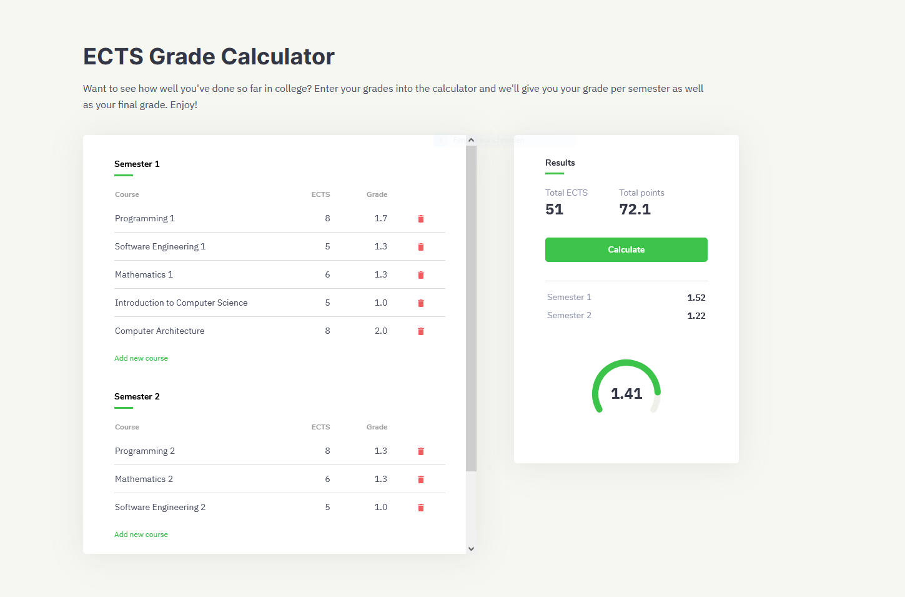
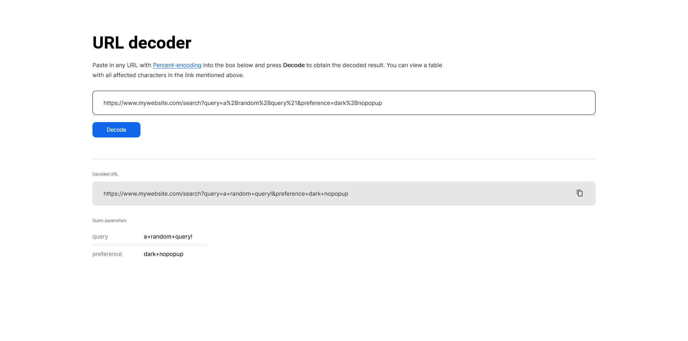
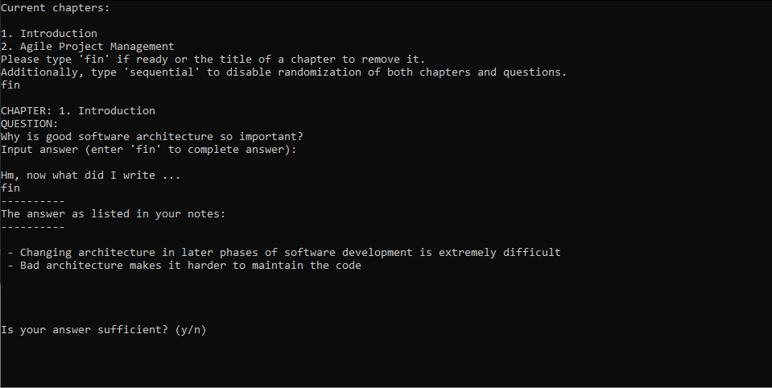
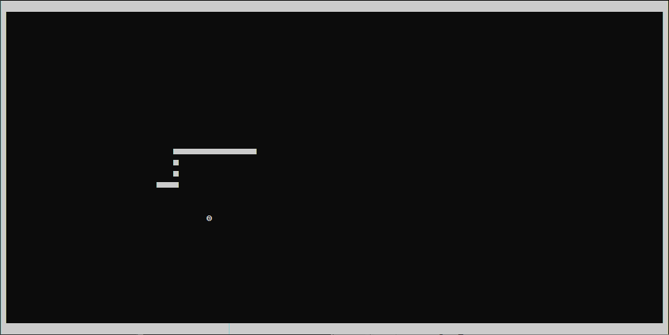
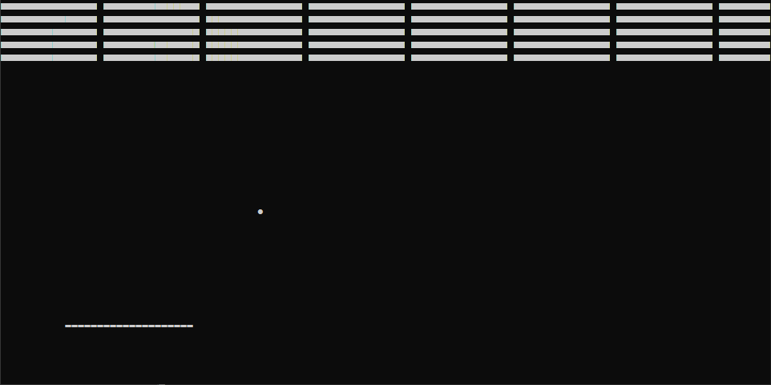

# Tiny applets
A personal collection of small applets and / or command line tools that do not
warrant their own repository. There is no particular topic these applets focus
on - some of them are neat tools to help with organization and some are command
line games and so on.

I implemented these primarily with Python and JavaScript using as few libraries
as possible, but I occasionally made use of other programming languages and / or
technologies as well. Refer to the ``README`` of each individual applet for more
information.

## Usage

### JavaScript
Currently, all JavaScript applets can be run simply by opening the respective
HTML file in a browser.

### Python
To run a Python applet, execute the following command in a terminal window:

```bash
python <filename>
```

Some applets may require certain libraries to be installed - for instance, the
timer app uses the package ``pyqt5``. In order to install such packages, I
recommend setting up a virtual environment:

```bash
python -m venv venv
```

On Windows, activate your virtual environment using:

```bash
cd venv/Scripts
activate
```

On UNIX systems, activate it using the following command instead:

```bash
. venv/bin/activate
```

Once activated, change into the directory of the applet you want to run and
execute the following command:

```bash
pip install -r requirements.txt
```

You should now be able to run the applet as usual using ``python``.

## List of applets

### 🎓 ECTS grade calculator

**Languages used**: HTML, CSS, JavaScript

**Libraries used**: None

Want to see how well you've done in college? Enter your grades into the
calculator and it'll give you your final grade.

### 🌐 URL decoder

**Languages used**: HTML, CSS, JavaScript

**Libraries used**: None

URLs are commonly encoded in
[Percent-encoding](https://en.wikipedia.org/wiki/Percent-encoding), which allows
otherwise illegal characters to be used in URLs. With this URL decoder, you can
enter in any URL with such encoded characters and have the app decode the URL
for you.

### 🎇 Pokémon coverage checker
**Languages used**: HTML, CSS, JavaScript

**Libraries used**: None

Check how your team's coverage fares against all Pokémon types. Useful
for building your next competitive team, whether it is for post-game battle
facilities or ranked online matches!

### 💥 Voltorb Flip
**Languages used**: HTML, CSS, JavaScript

**Libraries used**: React

A classic from the Pokémon HeartGold / SoulSilver games. Flip tiles to score
points, but avoid voltorbs - or the game will end!

### ⚔ Fire Emblem Combat Simulator
**Languages used**: Python

**Libraries used**: None

Even though RNG dictates the outcome of a typical Fire Emblem battle, it may
still be interesting to simulate a given encounter dozens of times and see just
how often the initiator would win.

### 📝 Study helper

**Languages used**: Python

**Libraries used**: None

Particularly useful for studying. Import a text document with your notes and
the study helper will ask you questions based on what you've written in your
notes.

### 📄 File transfer app
**Languages used**: Python

**Libraries used**: ``pyqt5``

If you have multiple devices, then you will probably have to transfer files
between them occasionally. Instead of picking up the nearest USB stick or
uploading the files to the cloud, you can use this app, which allows you to
send and receive files from other, nearby devices.

### 🕔 Timer app
**Languages used**: Python

**Libraries used**: ``pyqt5``

Where did the time go? Track how much time you spend on different activites,
such as studying or relaxing, and if necessary, adjust your schedule
accordingly!

### 🍅 Pomodoro app
**Languages used**: Python

**Libraries used**: None

In a similar vein to the previously shown timer app, this app allows you to set
a timer as described in the
[Pomodoro technique](https://en.wikipedia.org/wiki/Pomodoro_Technique). Once
the timer expires, you will be reminded to take a break, with every fourth
expiration resulting in a longer break. Take everything in moderation!

### 🐍 Snake game

**Languages used**: Python

**Libraries used**: ``asciimatics``

A classic game that probably everyone has played at least once. Control a snake
and eat the surrounding fruit, but avoid going out of bounds ... or hitting
yourself!

### ⬜ Breakout

**Languages used**: Python

**Libraries used**: ``asciimatics``, ``pynput``

Yet another classic and equally as popular game. Take control of a paddle and
bounce the ball back and forth to destroy bricks!
